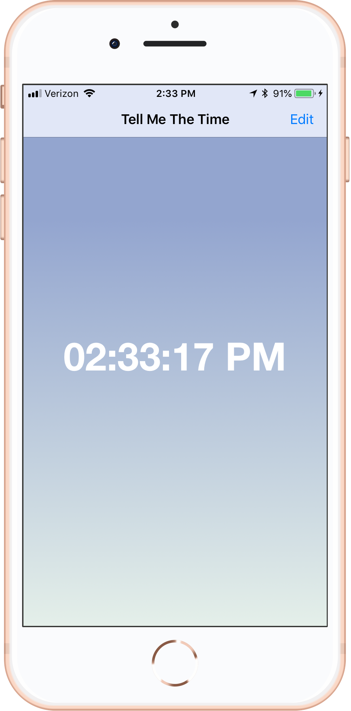
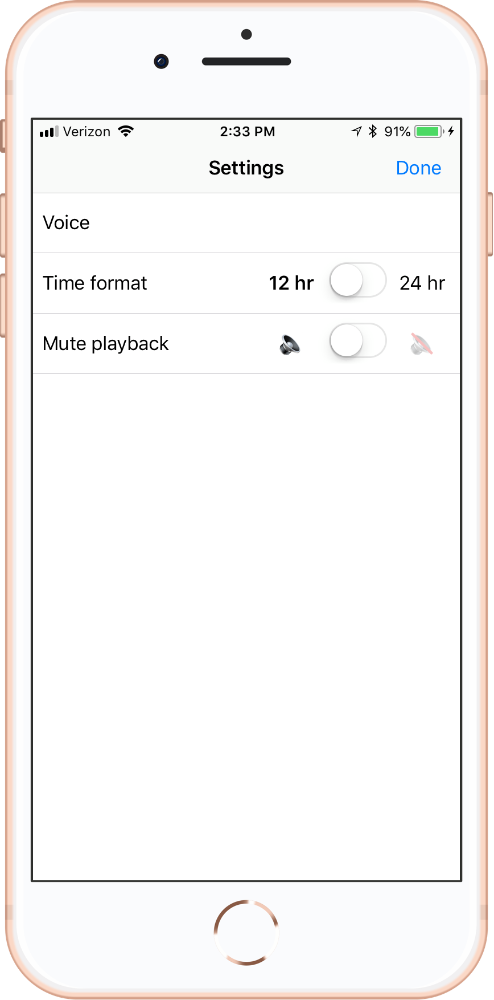
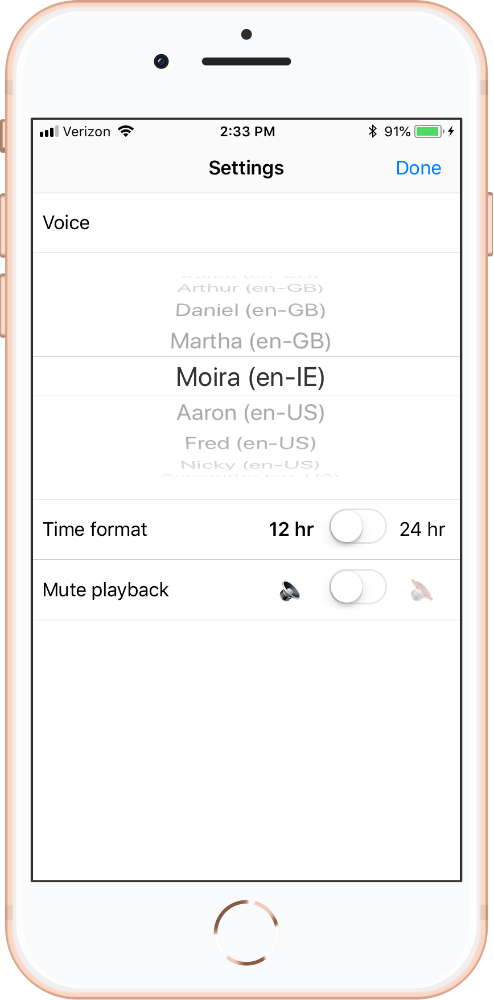

# Tell Me The Time

A simple iOS app that reads the time out loud, every minute on the minute.

Built with Swift and the Interface Builder.

Leave the app open to have it say the time each minute. Tapping the screen will also trigger a reading of the time.

Control the voice, time format, and optionally mute from the settings view.

Tap on the voice label to select any of the available voices in your current locale.

